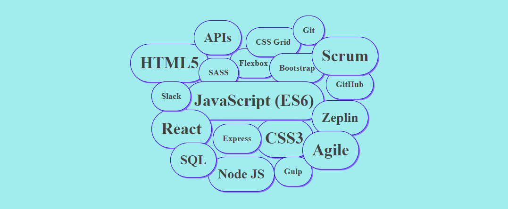

Hi everyone :open_hands:

I am

<h2 align="center">
  
   
</h2>

> **NOTE:** Gif of website made with HTML5 and CSS3

## About me :speech_balloon:

Front-end **developer** and passionate about Digitalization, music and coffee.
During the last **13 years** I have worked in various companies and law firms. Living in four countries and
working in three languages made me very **open to change**.

After moving to Spain, I discovered my **new passion: Front-end** development. A role where I can **constantly
keep on learning** and where my strengths such as **attention to detail, creativity** and **organization** are key
skills.

## Sobre mi :speech_balloon:

Front-end **developer** y gran apasionada de la Digitalización, la música y el café.
Durante los últimos **13 años** he trabajado en diferentes empresas y bufetes de abogados. Tengo gran
capacidad de **adaptación a los cambios**: he vivido en cuatro países, trabajado en 3 idiomas y soy una persona
muy **abierta** a culturas diferentes.

Tras llegar a España descubrí mi **nueva pasión**: el desarrollo **front-end**. Un rol donde puedo seguir
**aprendiendo constantemente** y donde misfortalezas como la **atención al detalle, creatividad** y **organización**
son claves.

## Technologies, frameworks & tools

<h2 align="center">
  
   
</h2>

> **NOTE:** Picture of website made with HTML5 and CSS3

## Projects

 

## Contact info 🖋

Please don't hesitate to **contact me**. Click on the following links:

- [LinkedIn](https://www.linkedin.com/in/camilla-bachna)
- [Email](mailto:camilla.bachna@gmail.com?subject=[GitHub])

## Statistics

